# pyBEM: Multi-Zone Examples & How-To Guide

Welcome to the `how-to_examples` directory for **pyBEM (V0.5.0-alpha)**. This guide details the workflow for creating, exporting, and verifying multi-zone Boundary Element Method (BEM) acoustic models using PrePoMax and pyBEM.

---

## 1. Core BEM Meshing & Modelling Rules

To ensure mathematical formulation and convergence during the BEM assembly stage, all input meshes must strictly comply with the following architectural rules:

1. **Watertight Domains:** Every BEM acoustic zone must be a completely closed, watertight surface (shell) mesh. MICS meshes do not need to comply with this rule, but be at least half the BEM element size away from the boundary.
2. **Normal Orientation (CRITICAL):** All BEM element normals **MUST point AWAY from the acoustic domain** (pointing outward for interior acoustic domains or inwards for exterior ones).
3. **Unique Entity IDs:** Node and element IDs exported from PrePoMax must be unique. Sequential gaps ("jumps") in ID numbers are fully supported for both BEM & MICS meshes, this happens when re-meshing a part.
4. **Zone Declaration via Materials:** Acoustic zones are declared by assigning a matching **Material Name** to BEM elements and (optional) MICS elements for a given zone.
5. **Element Types:** Supported shell elements include 3-node linear triangles (`S3`, `mics_S3`) and 4-node linear quadrilaterals (`S4`, `mics_S4`).

---

## 2. PrePoMax Workflow & `*.inp` Export

PrePoMax is used as the primary pre-processor for mesh generation, surface grouping, boundary condition assignments and analysis setup. Because PrePoMax is designed primarily for structural FEA, custom acoustic keywords are injected via the PrePoMax **Keywords Editor**.

### 2.1 Mesh Generation & Normal Verification

1. Mesh BEM domain surfaces using linear shell elements (`S3` or `S4`).

    ```ini
    **
    ** Elements ++++++++++++++++++++++++++++++++++++++++++++++++
    **
    *Element, Type=S3, Elset=bem_z1
    1, 69, 68, 67
    ...
    *Element, Type=S4, Elset=bem_z1
    2, 6, 5, 67, 68
    ...
    **
    ```

2. Optional MICS visualisation meshes (used for ParaView contours) should be assigned the same BEM zone material name, and use shell (custom) elements (`mics_S3` or `mics_S4`).

    ```ini
    *Element, Type=mics_S4, Elset=mics_z1
    510, 517, 507, 536, 608
    *Element, Type=mics_S3, Elset=mics_z1
    570, 530, 531, 629
    ```

3. Use PrePoMax visual tools to verify that all shell surface normals point **away** from the acoustic fluid domain. pyBEM will automatically identify this at pre-processing, and assign either an **interior or exterior** zone analysis depending on the direction of the normals. Here is a typical `.log` file entry on acoustic zones:

    ```log
        ==============================
        *** INPUT MESH DIAGNOSTICS ***
        ==============================
        Found a total of ( 2 ) Acoustic ZONES as follows:
        
    --> ZONE: [ z1_Air ]
        BEM Surface Area:           ( 170712 L**2 )
        CoG of BEM zone:            [ 249.99, 0.01, 0.02 ] L
        Max Element Aspect Ratio:   ( 1.75 )
        Element Size (approx):      ( 31.38 L )
        Suggested Max Freq:         ( 1366.3 Hz )
        Closed (+) Volume detected: ( 3.79026e+06 L**3 )
        -> Normals point OUTWARDS ==> Assuming INTERIOR Analysis

    --> ZONE: [ z2_Air ]
        BEM Surface Area:           ( 170564 L**2 )
        CoG of BEM zone:            [ 749.98, -0.04, -0.00 ] L
        Max Element Aspect Ratio:   ( 1.52 )
        Element Size (approx):      ( 33.27 L )
        Suggested Max Freq:         ( 1289.0 Hz )
        Closed (+) Volume detected: ( 3.7748e+06 L**3 )
        -> Normals point OUTWARDS ==> Assuming INTERIOR Analysis

    --> BC-PROCESSING: BC resolution complete ==> ( 48 ) elements have active BCs.
    ```

### 2.2 Acoustic Material Properties

Define fluid properties in PrePoMax using density ($\rho$) and Bulk Modulus ($K$):

* **Density ($\rho$):** e.g., $1.21 \times 10^{-12} \text{ tonne/mm}^3$
* **Bulk Modulus ($K$)**, via keywords editor: e.g., $0.14239 \text{ MPa}$ (yielding speed of sound $c = \sqrt{K / \rho} \approx 343,000 \text{ mm/s}$)

    > Material names are also used to define different acoustic zones (BEM & MICS) via element sets:

    ```ini
    **
    ** Materials +++++++++++++++++++++++++++++++++++++++++++++++
    **
    *Material, Name=z1_Air
    *Density
    1.21E-12
    *Acoustic Medium
    0.1424,
    ** Bulk modulus (B): c = sqrt(B/Rho)
    *Material, Name=z2_Air
    *Density
    1.21E-12
    *Acoustic Medium
    0.1424,
    ** Bulk modulus (B): c = sqrt(B/Rho)
    **
    ** Sections ++++++++++++++++++++++++++++++++++++++++++++++++
    **
    *Shell section, Elset=z1_bem, Material=z1_Air, Offset=0
    1
    *Shell section, Elset=z2_bem, Material=z2_Air, Offset=0
    1
    *Shell section, Elset=z1_mics, Material=z1_Air, Offset=0
    1
    *Shell section, Elset=z2_mics, Material=z2_Air, Offset=0
    1
    ```

### 2.3 Surface Definitions & TIED Pairs

* Group BEM or MICS elements into named **Surfaces** (e.g., `INLET`, `OUTLET`, `SILENCER_WALLS`). These are then used for BCs application in the input deck, plus power calculations and plots generated (by default) at the end of a pyBEM job.
* For multi-zone models, define **TIED Pairs** between Master and Slave surfaces. PrePoMax will generate the surfaces automatically when selecting them during the tie setup in the UI. pyBEM enforces interface continuity via a Dual-Lagrange collocation solver. It handles non-conforming interface meshes, and auto-selects the best slave-master pairing for better accuracy across the interface; i.e. no need to think which one should be the master or slave, the solver will make that decision at pre-processing.

    ```ini
    **
    ** Constraints +++++++++++++++++++++++++++++++++++++++++++++
    **
    *Tie, Name=Tie-1, Position tolerance=1
    Internal_Selection-1_Tie-1_Slave, Internal_Selection-1_Tie-1_Master
    **
    ```

> [!NOTE]
> By default, `pyBEM` will calculate all acoustic powers (mag or "Apparent", real or "Active", imag or "Reactive") and additional surface metrics going through each of the surfaces defined in the input file. It also generates a figure with plots for SWL (Sound Power Level - dB). At the end of each job look out for the `CSV` & `PNG` files.

### 2.4 Step Definition, Damping & Amplitudes

1. Set up a direct frequency analysis step defining start frequency, end frequency, and total number of frequencies to solve.
2. Specify acoustic Damping Ratio ($\zeta$) if applicable (note that Loss Factor $\eta = 2\zeta$).
3. Define optional frequency amplitude curves (`*AMPLITUDE`) to combine with boundary conditions (separate real and/or imaginary parts) or damping.

### 2.5 Acoustic BCs Keywords & Export

1. Open the PrePoMax **Keywords Editor** prior to export to insert commands in order to apply acoustic boundary conditions on surface names within the STEP definition:

   * **PRES:** Pressure boundary condition ($P = \bar{p}$).
   * **VELO:** Element normal velocity ($v_n = \bar{v}$).
   * **IMPE:** Acoustic surface impedance; e.g. ($Z = \rho c$).
   * **VELO + IMPE:** Combined normal velocity with surface impedance.

    > Example STEP definition showing the format for damping and BCs:

    ```ini
    **  lines starting with more than one * are comments, 
    **  handy to switch on/off BCs on model variants.
    *Step
    *Steady state dynamics
    20, 1200, 119, 1
    **
    ** Damping +++++++++++++++++++++++++++++++++++++++++++++++++
    **
    *Modal damping
    1, 1000000, 0.01
    **
    ** Boundary conditions +++++++++++++++++++++++++++++++++++++
    **   Load case=1 ==> real | Load case=2 ==> imaginary
    *Boundary, op=New
    ** Ac. pressure - on a Surface - DoF = 8
    *Boundary, Load case=1
    inlet, 8, 8, 2E-11
    **
    ** Acoustic Impedance - on a Surface
    ** *Impedance, Load case=1
    ** inlet, 4.1503e-7
    ** outlet, 4.1503e-7
    **
    **
    ** Loads +++++++++++++++++++++++++++++++++++++++++++++++++++
    **
    *Cload, op=New
    *Dload, op=New
    ** Name: Vels: Deactivated
    ** Acoustic Vels - on a Surface - DoF = 8
    ** *Cload, Load case=1
    ** inlet, 8, 5e-5
    **
    *End step
    ```

2. Export the setup as an `*.inp` input file ready for pyBEM.

---

## 3. EXAMPLES

The sub-folders under `how-to_examples/` contain complete input decks, some results, and comparison plots for various acoustic setups, as solved in pyBEM.

```text
how-to_examples/
├── README.md
├── assets/                  # Figures
└── 1m_pipe/                 # PrePoMax *.inp input decks (Cases 1-6 x 2 meshes)
    ├── 01_zones_pipe_1m.inp
    ├── 01_tri_zones_pipe_1m.inp
    ├── ...
    ├── ...
    ├── 06_zones_pipe_1m.inp
    └── 06_tri_zones_pipe_1m.inp
├── ...
```

---

### 3.1 `1m_pipe`: Straight 1m Pipe Analysis Suite

> [!NOTE]
> $L = 1.0 \times 10^{3}\text{ mm}$ ; $c = 343 \times 10^{3}\text{ mm/s}$ ; $\rho = 1.21 \times 10^{-12}\text{ tonne/mm}^3$ ; Damping Factor = 1%

This suite demonstrates **6 boundary condition (BC) variants** for a $1\text{m}$ circular straight duct, across a frequency sweep $20\text{Hz} - 1200\text{Hz}$. These 6 cases were solved for **2 different meshes**: QUADs and all TRIAs (about 2 x DoF vs QUADs mesh) to illustrate further BEM acoustics with a standard collocation method at element centroids (DoF), and help to understand their corresponding pros and cons for each application and/or model size (BEM element count).

> **Meshes**: figure shows details of the meshes and ties for the 2 models

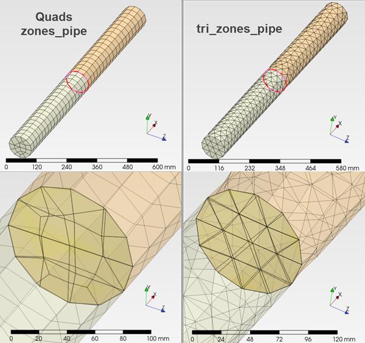

In acoustics a simple straight pipe with BC variants at the inlet & outlet surfaces can demonstrate key properties, tricks for fast post-processing and understanding of results that will later on appear with complex 3D interior acoustics systems; e.g. intake & exhaust systems. They'll help to allow for **fast & informed decision making**, which I believe is the primary objective of any CAE work for research or in-production.

We can easily model half-wave pipes (open or closed both ends) and quarter-wave pipes (open one end, rigid the other end), and compare to simple hand calculations on resonant frequency peaks. Furthermore, it is a simple and fast model to test a new acoustics solver on some basic principals, and compare to other solvers.

The `*.inp` input files supplied in this folder solve at every 10Hz for fast initial turnaround to start getting a grasp with pyBEM. Nevertheless, the result graphs shown for each case were generated at every 1Hz, to catch properly all frequency peaks with a small 1% of damping. Furthermore, this finer frequency stepping allows for fair comparisons to other codes, as a too coarse freq solve may miss peaks slightly differently. These pipe models comprise **2 interior zones & 1 TIED pair**; this is to show the multi-zone capability.

> [!TIP]
> You can use the script `run_suite.py` supplied in the `pyBEM_code` folder, to batch solve all *.inp files found in a given directory.

#### 3.1.1 CASE 1: PRES @ INLET & Rigid OUTLET

* **Boundary Conditions:**
  * **Inlet:** Sound Pressure ($P = 2\times 10^{-11}\text{ MPa}$)
  * **Outlet:** Rigid Boundary (Default: $v_n = 0\text{ mm/s}$)

* **Acoustic Behaviour:** Classic quarter-wave resonator: open one end & closed the other end. Resonant peaks occur at odd harmonics:

$$f_n = \frac{(2n - 1) c}{4L} = 85.75, 257.25, 428.75, 600.25\dots \text{ Hz}$$

> **SWL (dB)**: automatic power outputs in pyBEM

Note how frequency peaks match hand calculation for a quarter-wave pipe.

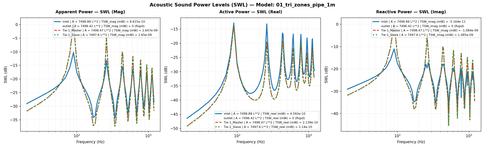

> **SPL (dB) & Power (mW)**: Abaqus vs pyBEM

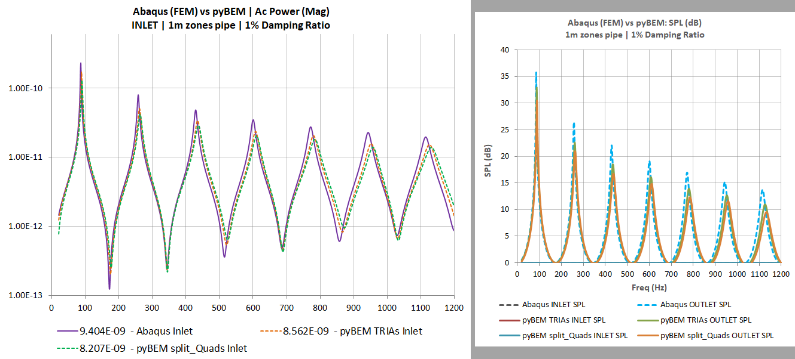

> **Power (mW) at TIED pair**: Abaqus vs pyBEM.

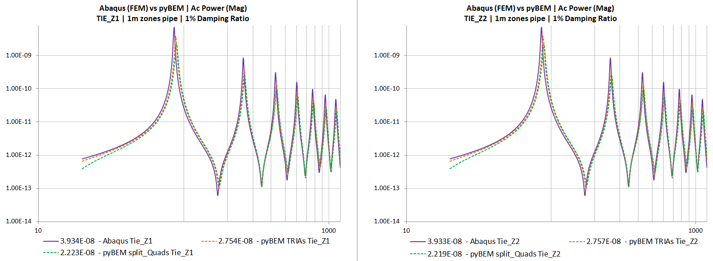

> **SPL (dB) Contours**: pyBEM results in ParaView

Figure shows SPL distribution at 260Hz.

The slight differences on contours and SPL graph peaks are expected at every 10Hz with different mesh densities and single zone vs 2 zones for the purposes of this example. It is common in-production to compare designs, meshes for a coarse freq stepping first, then solve finally approved models, at every 1Hz; like it was done in graphs above.

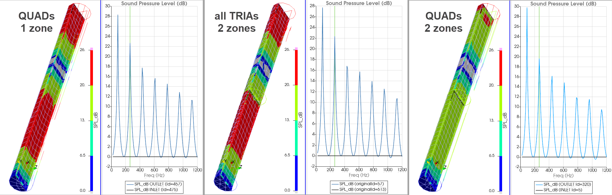

---

#### 3.1.2 CASE 2: PRES @ INLET & PRES @ OUTLET

* **Boundary Conditions:**
  * **Inlet:** Sound Pressure ($P = 2\times 10^{-11}\text{ MPa}$)
  * **Outlet:** Sound Pressure ($P = 2\times 10^{-11}\text{ MPa}$)

* **Acoustic Behaviour:** Half-wave pipe *open* at both ends. Resonant peaks occur at integer half-wave harmonics:

$$f_n = \frac{n \cdot c}{2L} = 171.5, 343.0, 514.5, 686.0\dots \text{ Hz}$$

> **SWL (dB)**: automatic power outputs in pyBEM

Note how frequency peaks match hand calculation for a half-wave pipe. In this case, both ends have constant pressure, and it is not trivial to capture clearly all resonant peaks at inlet or outlet. See power curves for the tie surfaces in the middle of the pipe, showing more peaks.

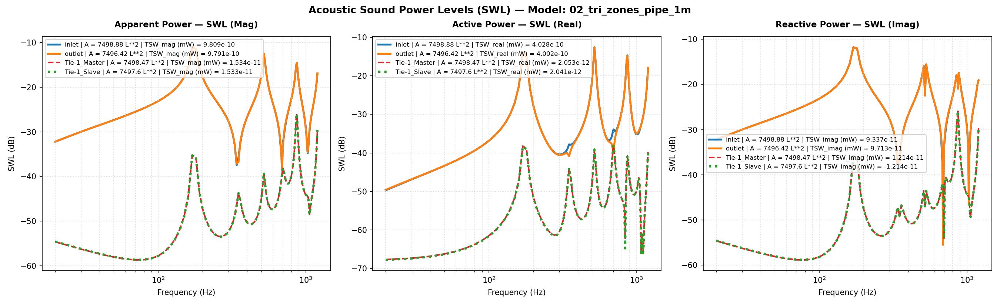

> **Power (mW)**: Abaqus vs pyBEM

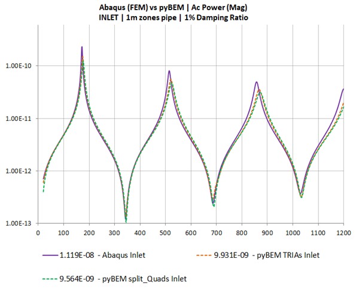

> **SPL (dB) Contours**: pyBEM results in ParaView

Figure shows SPL distribution at 1200Hz.

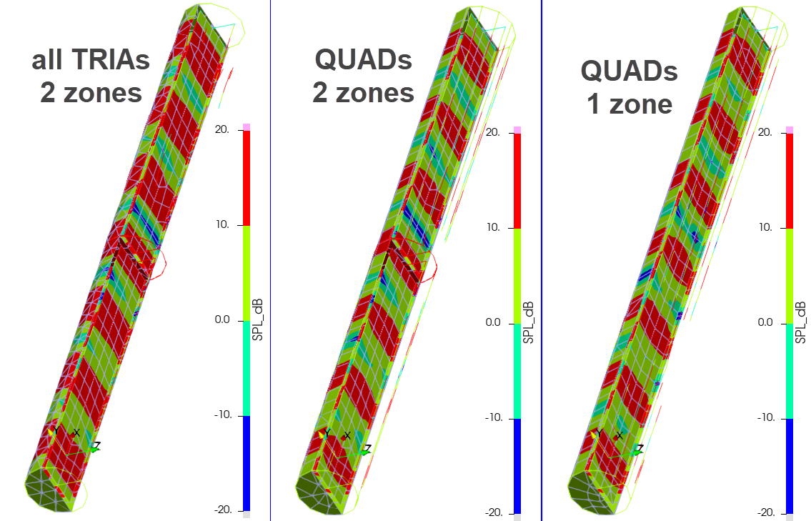

---

#### 3.1.3 CASE 3: PRES @ INLET & IMPE ($Z = \rho c$) @ OUTLET

* **Boundary Conditions:**
  * **Inlet:** Sound Pressure ($P = 2\times 10^{-11}\text{ MPa}$)
  * **Outlet:** Anechoic Impedance ($Z = \rho \cdot c$)

* **Acoustic Behaviour:** Non-reflecting anechoic termination. Acoustic energy exits without internal reflections, yielding a frequency response with no standing wave peaks.

> **SWL (dB)**: automatic power outputs in pyBEM

Note the wiggles in pyBEM are noise, inherent in BEM, unless high mesh density is used. However, note the small range on the scales used. Normally the noise should be small enough compared to relevant sound level results; i.e. application dependant.

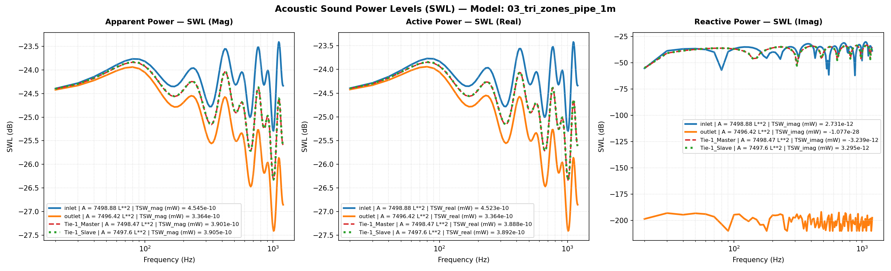

> **Power (mW)**: Abaqus vs pyBEM

We can observe the effect mentioned above in the comparison: all TRIAs (higher DoF in matrix solve, less noisy) vs QUADs models.

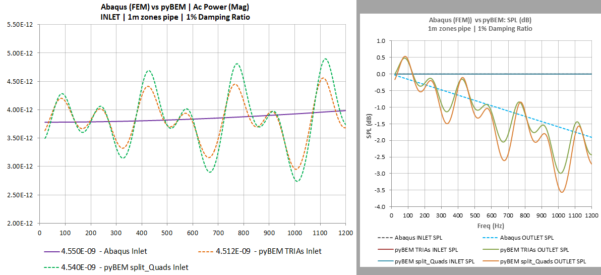

> **SPL (dB) Contours**: pyBEM results in ParaView

Figure shows SPL distribution at 1200Hz. Note the small scales range used for this specific case.

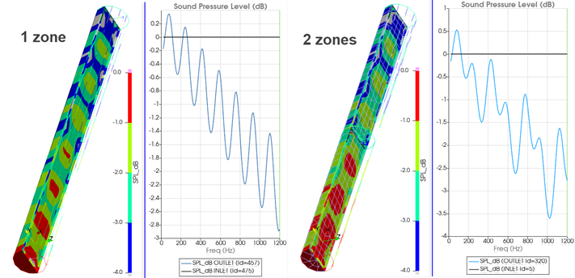

---

#### 3.1.4 CASE 4: VELO @ INLET & Rigid OUTLET

* **Boundary Conditions:**
  * **Inlet:** Normal Velocity ($v_n = 5\times 10^{-5}\text{ mm/s}$) | Rigid piston
  * **Outlet:** Rigid Boundary (Default: $v_n = 0\text{ mm/s}$)

* **Acoustic Behaviour:** Half-wave pipe *closed* at both ends. Resonant peaks occur at integer half-wave harmonics:

$$f_n = \frac{n \cdot c}{2L} = 171.5, 343.0, 514.5, 686.0\dots \text{ Hz}$$

> **SWL (dB)**: automatic power outputs in pyBEM

Note how frequency peaks match hand calculation for a half-wave pipe.

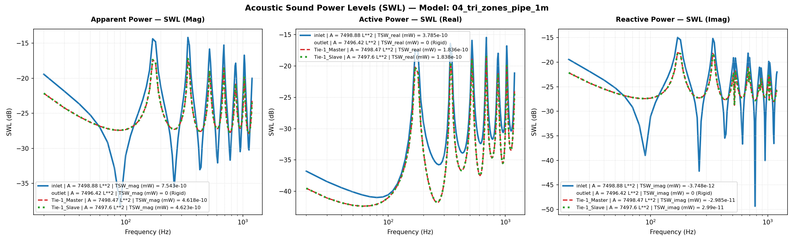

> **Power (mW)**: Abaqus vs pyBEM

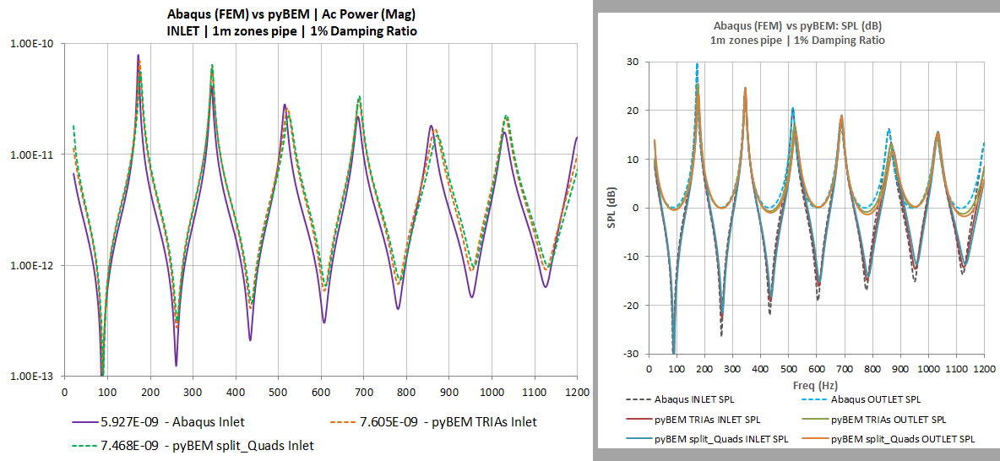

> **SPL (dB) Contours**: pyBEM results in ParaView

Figure shows SPL distribution at 340Hz.

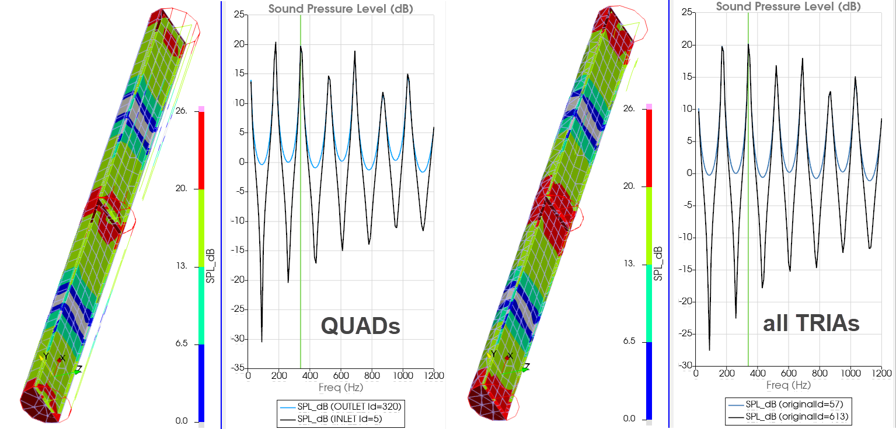

---

#### 3.1.5 CASE 5: [ VELO + IMPE ($Z = \rho c$) ] @ INLET & Rigid OUTLET

* **Boundary Conditions:**
  * **Inlet:** Normal Velocity ($v_n = 5\times 10^{-5}\text{ mm/s}$) + characteristic Impedance ($v_n + Z_0$)
  * **Outlet:** Rigid Boundary (Default: $v_n = 0\text{ mm/s}$)

* **Acoustic Behaviour:** Classic quarter-wave resonator: open one end (VELO + IMPE) & closed the other end. Resonant peaks occur at odd harmonics:

$$f_n = \frac{(2n - 1) c}{4L} = 85.75, 257.25, 428.75, 600.25\dots \text{ Hz}$$

> **SWL (dB)**: automatic power outputs in pyBEM

Note how frequency peaks match hand calculation for a quarter-wave pipe.

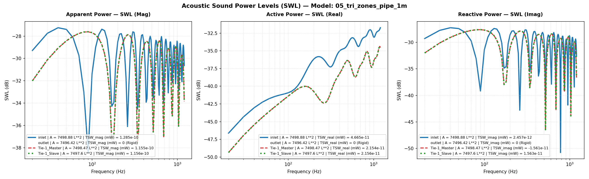

> **SPL (dB)**: Abaqus vs pyBEM

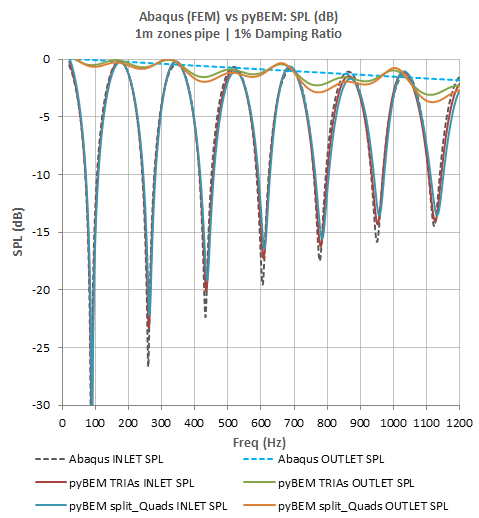

> **SPL (dB) Contours**: pyBEM results in ParaView

Figure shows SPL distribution at 260Hz.

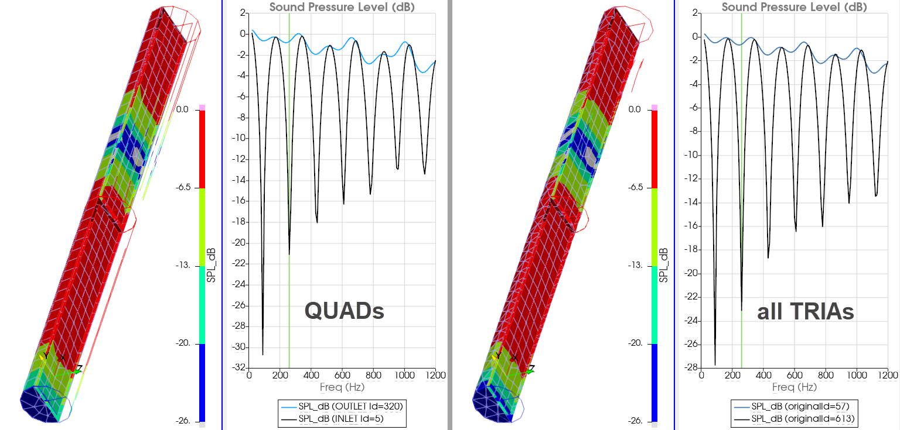

---

#### 3.1.6 CASE 6: VELO @ INLET & IMPE ($Z = \rho c$) @ OUTLET

* **Boundary Conditions:**
  * **Inlet:** Normal Velocity ($v_n = 5\times 10^{-5}\text{ mm/s}$) | Rigid piston
  * **Outlet:** Anechoic Impedance ($Z = \rho \cdot c$)

* **Acoustic Behaviour:** Velocity-driven pipe with non-reflecting anechoic termination at outlet. Acoustic energy exits without internal reflections, yielding a frequency response with no standing wave peaks.

> **SWL (dB)**: automatic power outputs in pyBEM

Note the wiggles in pyBEM are noise, as explained for CASE 3.

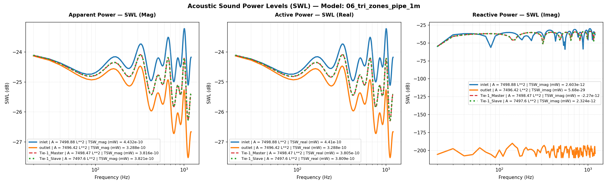

> **SPL (dB)**: Abaqus vs pyBEM

We can observe the effect mentioned above in the comparison: all TRIAs (higher DoF in matrix solve, less noisy) vs QUADs models.

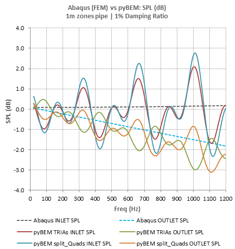

> **SPL (dB) Contours**: pyBEM results in ParaView

Figure shows SPL distribution at 1200Hz. Note the small scales range used for this specific case.

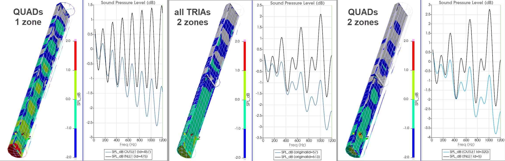

---

#### 3.1.7 `1m_pipe`: Comparison code_aster (FEM acoustics) vs pyBEM

At the time of implementing the multi-zone capability in pyBEM, as well as the Abaqus comparisons shown above, I also solved the pipe 6 cases in code_aster (FEM).

> **SPL (dB) Contours**: code_aster results in ParaView

Figure shows **code_aster** SPL (dB) distribution for the 6 cases presented above.

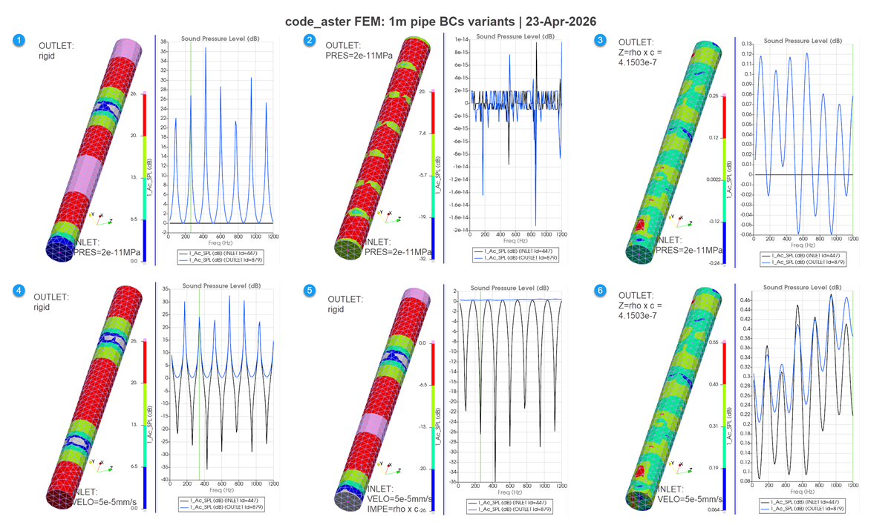

> **SPL (dB) Contours**: pyBEM results in ParaView

Figure shows **pyBEM** SPL (dB) distribution for the 6 cases presented above.

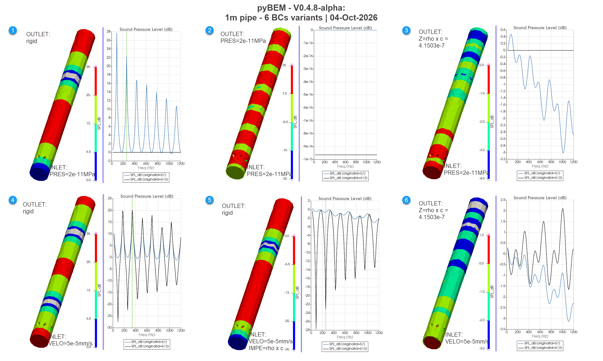

---

#### 3.1.8 `1m_pipe`: Preliminary Conclusions

* It is emphasised that trying to compare like-to-like across FEM vs BEM solvers with different meshes, damping and acoustic boundary conditions implementations; makes it hard to expect exactly the same results.

* Nevertheless, comparisons are still useful in terms of honouring basic principals for linear acoustics in pyBEM. Sensible similar trends are expected and hand calculations on resonant frequency values should be very close to predictions.

* Based on the results presented in this section for the 6 cases, we can conclude that pyBEM results are close to the Abaqus and code_aster results. They are all certainly *on the same bit of paper*.

* This is encouraging in terms of continuing with the multi-zone and TIED pairs capabilities, and with  further testing of pyBEM with more complex 3D geometries and setups.

---

> [Back to MAIN page](../README.md)

---
